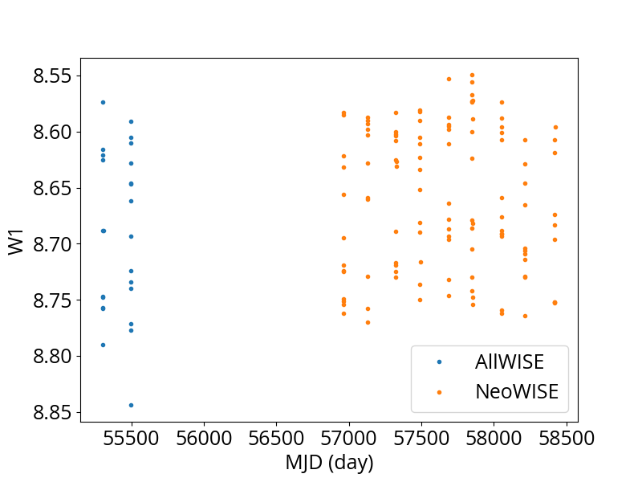
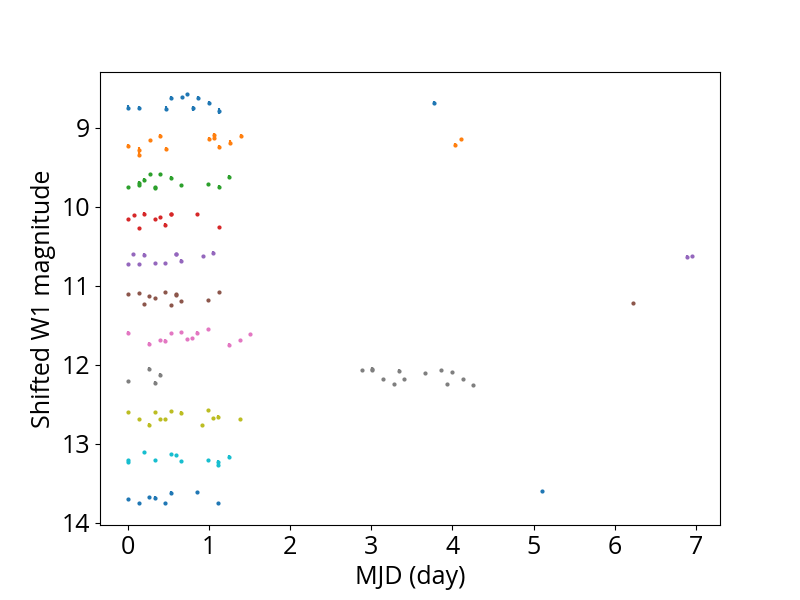
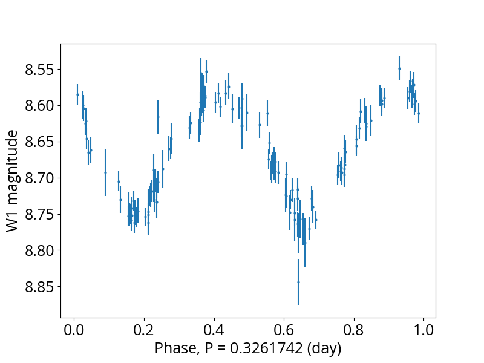

# wise_light_curves
`wise_light_curves` is a Python module to download and explore WISE light curves. The codes are contributed by Hsiang-Chih Hwang and Matthew Hill. This module is written for Python 3, and it depends on the following packages: `astropy, matplotlib, numpy`. This module is not fully tested in Python 2.7, but we expect it to be compatible with Python 2.7.

Some useful functions of `wise_light_curves` include:
1. functions to download light curves from AllWISE and NeoWISE;
2. tools to manipulate the light curve data and investigate their properties.

We provide a tutorial Jupyter notebook for this module, tutorial.ipynb. Below, we go through the functions of `wise_light_curves` that are used in the tutoral.

## Import

First, import the module:

```python
import wise_light_curves
```

## Example 1: download WISE light curves

`download_single_data`: before using this function, create a folder where you want to store the WISE light curve data. In this example, we create a folder "ipac". Then we call `download_single_data` to download the WISE light curves, including AllWISE and NeoWISE data, using the ra dec coordinate. Notice that if `download_single_data` finds a file with the same requested file name in the folder, then `download_single_data` does not download the data. 

```python
ra = 113.7677455178
dec = -33.1498446736699
download_single_data(name='wise_0735-3308', ra=ra, dec=dec, root_path='ipac/', radius=2.)
```

It may take about 20 seconds to download the light curves. After that, we will find `wise_0735-3308_allwise.ipac` and `wise_0735-3308_neowise.ipac` under the `ipac\` folder.


## Example 2: explore the WISE light curves

We first read the ipac files using astropy's `ascii` function:
```python
from astropy.io import ascii
allwise = ascii.read('ipac/wise_0735-3308_allwise.ipac', format='ipac')
neowise = ascii.read('ipac/wise_0735-3308_neowise.ipac', format='ipac')
```

We use the function `only_good_data_v1` to remove bad photometric measurements. The criteria used in this function are detailed in Hwang & Zakamska (https://arxiv.org/abs/1909.06375), and more details are in the WISE Explanatory Supplement (see the Reference). Users are welcome to design their own criteria. 

```python
allwise, neowise = only_good_data_v1(allwise, neowise)
```

After filtering out bad data, we can explore the WISE light curves:
```python
plt.figure()
plt.plot(allwise['mjd'], allwise['w1mpro_ep'], '.', label='AllWISE')
plt.plot(neowise['mjd'], neowise['w1mpro'], '.', label='NeoWISE')
plt.gca().invert_yaxis()
plt.legend()
plt.xlabel('MJD (day)')
plt.ylabel('W1')
plt.show()
```



`plot_part_lightcurve` helps to see the variation on a shorter timescale. It uses the parameter `time_lapse_threshold` to cut the light curves into several segments, and present these segments with a magnitude shift (`mag_shift`).
```python
plt.figure()
plot_part_lightcurve(allwise, neowise, 
                     time_lapse_threshold=30.,
                     mag_shift=0.5, ms=2.,
                     band='w1'
                    )

plt.ylabel('Shifted W1 magnitude')
plt.show()
```




## Example 3: plot phase-folded light curves
`make_full_lightcurve_multibands` combine the AllWISE data and NeoWISE data, and returns arrays of time, magnitudes, matnitude errors, and filters.

```python
t, mag, mag_err, filts = make_full_lightcurve_multibands(allwise, neowise)
t_w1 = t[filts == 'w1']
mag_w1 = mag[filts == 'w1']
mag_err_w1 = mag_err[filts == 'w1']
```

With the period of this source, we are able to plot the phase-folded light curve:
```python
period = 0.1630871147 * 2

plt.figure()
plt.errorbar((t_w1 % period) / period, mag_w1, mag_err_w1, fmt='o', ms=2.)

plt.gca().invert_yaxis()
plt.xlabel('Phase, P = {:.7} (day)'.format(period))
plt.ylabel('W1 magnitude')
plt.show()
```




## References
Hwang & Zakamska (https://arxiv.org/abs/1909.06375)
